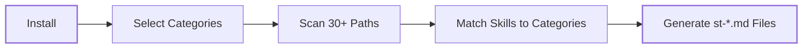

<p align="center">
  <h1 align="center">skilltags</h1>
</p>

<p align="center">
  <strong>One tag. All relevant skills. Automatically.</strong>
</p>

<p align="center">
  <a href="https://www.npmjs.com/package/skilltags"></a>
  <a href="LICENSE"></a>
  <a href="https://skills.sh"></a>
</p>

<br>

> **Tired of hunting for the right skill name every time you want the agent to actually use the skills you've installed?**

`skilltags` turns your installed skills into a small set of category commands like `/st-frontend`, `/st-backend`, and `/st-design`. Instead of remembering individual skill names, you add one category command to your prompt and the agent reviews the listed skill names and descriptions in that category to decide which skills are relevant to the request.

Built for the [skills.sh](https://skills.sh) ecosystem.

---

## The Problem

You install great skills, but when you prompt the agent, it just starts coding. It skips the skills entirely unless you explicitly tag each one by name. You end up hunting for exact skill names every single time.

## The Fix

<table>
<tr>
<td width="50%">

**Without skilltags**

```
I want to make my website components
look more modern and responsive.

```

The agent starts coding immediately. It does not check what relevant skills you have installed, so useful skills often go unused unless you explicitly reference them by name in your prompt.

</td>
<td width="50%">

**With skilltags**

```
I want to make my website components
look more modern and responsive.
/st-frontend
```

The agent reads the `st-frontend.md` command file, which contains a curated list of your installed frontend skill names and descriptions. The header instructs the agent to review that list, identify which skills are relevant to your request, and open only those skills before starting work.

</td>
</tr>
</table>

---

## Quick Start

```bash
npm install skilltags -g
```

The setup wizard runs on install. Pick your categories, enable auto-sync, done.

> [!TIP]
> New to skills? Browse and install from [skills.sh](https://skills.sh):
> ```bash
> npx skills find            # search the skills directory
> npx skills add owner/repo  # install a skill package
> ```

---

## Categories

Add a category command to the end of your prompt using `/`:

| Command | What kinds of skills it covers |
|:--------|:-------------|
| `/st-frontend` | React, Next.js, Vue, Tailwind, CSS, responsive design |
| `/st-backend` | APIs, auth, serverless, Stripe, webhooks |
| `/st-database` | Postgres, Supabase, Prisma, Drizzle, Redis |
| `/st-design` | UI/UX, typography, design systems, dark mode |
| `/st-testing` | Vitest, Playwright, Cypress, TDD, E2E |
| `/st-performance` | Core Web Vitals, lazy loading, code splitting |
| `/st-mobile` | React Native, Expo, Flutter, SwiftUI |
| `/st-devops` | Docker, GitHub Actions, Terraform, deployment |
| `/st-marketing` | SEO, Open Graph, structured data, analytics |
| `/st-accessibility` | WCAG, ARIA, screen readers, keyboard nav |
| `/st-ai-agents` | MCP, subagents, skill creation, browser automation |
| `/st-documentation` | Markdown, MDX, OpenAPI, Docusaurus |

> [!NOTE]
> Don't see a category you need? [Suggest one](https://github.com/steve-piece/skilltags/issues). We're always expanding the list.

---

## How It Works



| Step | What happens |
|:-----|:-------------|
| **Install** | Setup wizard asks which categories you want and whether to enable auto-sync |
| **Scan** | Checks 30+ agent skill directories on your machine with zero configuration |
| **Match** | Skills are mapped to categories via keyword analysis on names + descriptions |
| **Generate** | A `st-{category}.md` file is created for each category in `~/.cursor/commands/` |

### What's inside each command file

Each generated `st-{category}.md` file contains two parts:

1. **An instructional header** that tells the agent to review the listed skill names and descriptions, identify which ones are relevant to the user's request, and open those skills before starting work.
2. **A curated skill list** with every matched skill for that category, including its name, file path, and description.

> [!IMPORTANT]
> The instructional header is what makes this work. It tells the agent to evaluate the listed skills against the request first, instead of jumping straight into implementation.

<details>
<summary><strong>What does auto-sync do?</strong></summary>

<br>

When enabled, a shell wrapper is added to your `~/.zshrc` (or equivalent) that runs `skilltags sync --quiet` after every `skills add` or `skills remove`. Your category files stay up to date automatically with no manual re-sync needed.

</details>

---

## Commands

```
skilltags                      Sync category files from current config
skilltags sync                 Same as above (explicit)
skilltags update               Add or remove skill categories
skilltags update <category>    Edit skills within a specific category
```

<details>
<summary><strong>Flags</strong></summary>

<br>

| Flag | Description |
|:-----|:-------------|
| `--local` | Write to `.cursor/commands/` (project scope) instead of global |
| `--quiet` | Suppress all output (used by auto-sync hooks) |
| `-v`, `--version` | Print version |
| `-h`, `--help` | Show help |

</details>

Full reference: [docs/usage.md](docs/usage.md)

---

## Contributing

**Suggest a category.** Think a new skill category would be useful? [Open an issue](https://github.com/steve-piece/skilltags/issues) with the category name and what types of skills it should cover. The more specific the better. Including "what keywords should match this category?" helps us get it right.

**Improve keyword matching.** Category keyword mappings live in [`lib/categories.js`](lib/categories.js). If a skill isn't landing in the right category, PRs to improve the keyword lists are welcome.

---

<p align="center">
  <sub>MIT License</sub>
</p>
